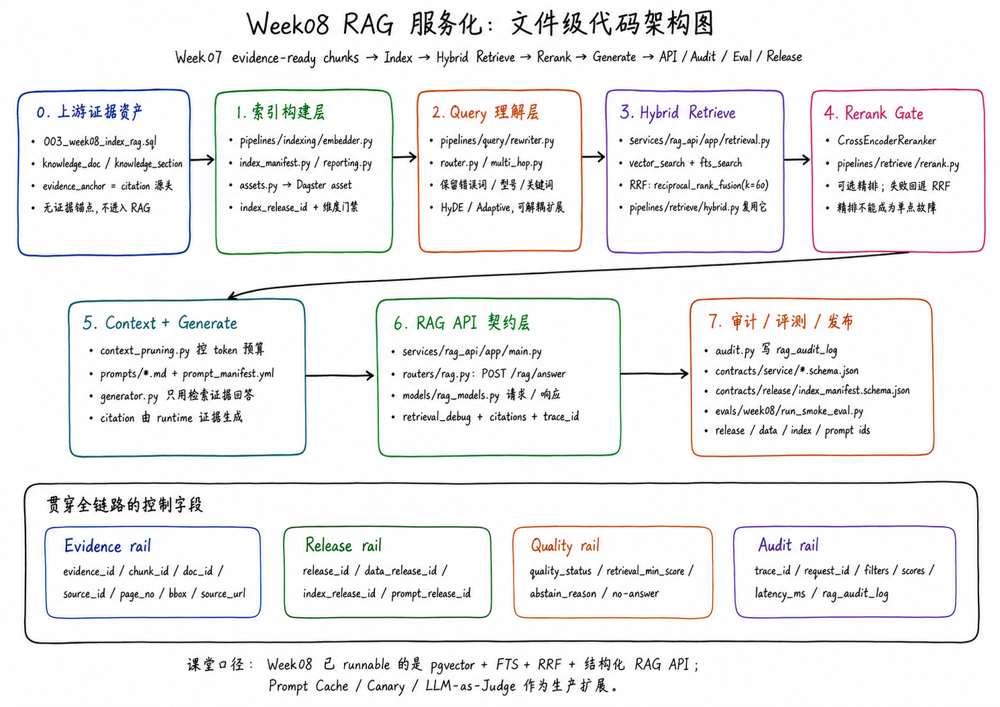
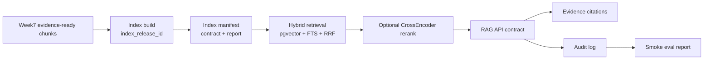

# Week8 RAG Engineering Blueprint

Week 8：从“搜得到”到“答得稳”——检索 × 生成的一体化工程闭环

## 目标

把 Week7 的可引用文档资产升级为：

- 可版本化索引资产
- 混合检索接口
- metadata filter 与权限边界
- optional rerank 门禁
- 结构化 RAG response
- Prompt as Code
- audit log
- smoke eval

PPT 对齐说明：`Week08-RAG服务化.pptx` 中的生产增强术语与本仓库代码路径的映射见
`docs/blueprints/week08/ppt-alignment-gap-check.md`。本周 Student Core 以可运行的
pgvector + FTS + RRF + 结构化 RAG API 为主，生产级 Query Rewrite、Prompt Cache、
LLM-as-Judge、Canary/rollback 执行器作为后续增强。

## 文件级代码架构图

这张图用于把 PPT 的五段式主线落到仓库文件：

- `pipelines/indexing/`：索引构建、index manifest、Dagster asset。
- `pipelines/query/`：Query Rewrite、HyDE、Adaptive RAG 的可解释脚手架。
- `services/rag_api/app/retrieval.py`：Hybrid Retrieve、RRF、rerank fallback。
- `services/rag_api/app/context_pruning.py` 与 `services/rag_api/app/prompts/`：
  Context Engineering 与 Prompt as Code。
- `services/rag_api/app/routers/rag.py`、`contracts/service/`、`audit.py`、
  `evals/week08/`：结构化 API、审计、评测和发布控制字段。

## 架构闭环

## 数据对象

| 对象 | 最小字段 | 作用 |
|---|---|---|
| Index manifest | `index_release_id`、`data_release_id`、`chunk_strategy_version`、`embedding_model`、`embedding_dim`、`built_at`、stats | 让索引构建可复盘 |
| Retrieval result | `chunk_id`、`doc_id`、`source_id`、evidence fields、score breakdown | 让检索排序可解释 |
| RAG response | `answer`、`citations`、`evidence_ids`、`confidence`、release ids、`trace_id` | 让答案可审计 |
| Prompt manifest | `prompt_release_id`、template files、description、created_at | 让提示词可版本化 |
| Audit record | question、filters、evidence ids、scores、answer、latency、release ids | 让 bad case 能回放 |

## 检索策略

1. Vector search 负责语义相似。
2. FTS 负责术语、型号、错误码、精确短语。
3. RRF 合并两路结果，避免单一路径误伤。
4. CrossEncoder 只对 Top-N 候选做二阶段精排。
5. 权限与 metadata filter 必须发生在 generation 之前。

## 生成策略

- Generator 只能使用 retrieval contexts。
- Citations 只能由 retrieval evidence metadata 生成。
- 如果没有足够证据，返回 no-answer，不强行编造。
- Prompt 文件化，`prompt_release_id` 进入 response 和 audit。

## 实验路径

1. 启动 Docker Compose。
2. 运行 contract tests。
3. 运行 index dry-run。
4. 运行 index build 或记录 provider fallback。
5. 调用 hybrid retrieval。
6. 比较 vector-only / FTS-only / hybrid RRF。
7. 关闭 reranker 验证 fallback。
8. 调用 RAG API。
9. 查看 citations、evidence_ids、release ids、trace_id。
10. 跑 smoke eval。

## 交付物

- `contracts/service/*.schema.json`
- `contracts/release/index_manifest.schema.json`
- `reports/week08/index_build_report.sample.md`
- `reports/week08/retrieval_smoke_report.md`
- `reports/week08/rag_api_smoke_report.md`
- `reports/week08/smoke_eval_report.md`
- `runbooks/week08-rag-engineering.md`
- `docs/blueprints/week08/week08-demo-script.md`
- `docs/blueprints/week08/week08-assignment-spec.md`
