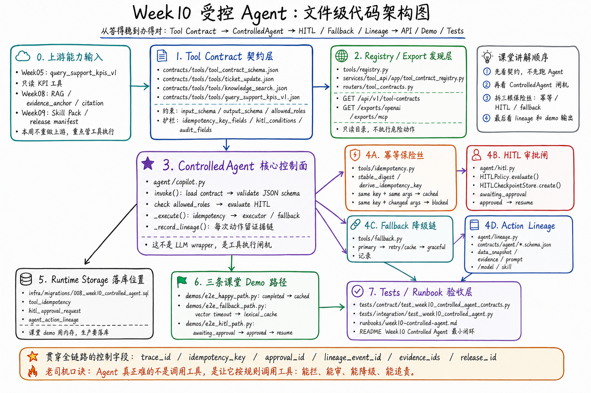

# Week10 Controlled Agent Blueprint

Week10 的目标不是“让大模型自己决定调用什么工具”，而是把 Agent 动作放进工程控制面：

1. **Tool Contract**：所有工具先声明输入、输出、角色、幂等键、审计字段和 HITL 条件。
2. **Routing / Fallback**：高确定性动作用规则路由；RAG 检索失败时先 retry/cache/graceful，不直接编造答案。
3. **HITL Checkpoint**：外部写入、退款、服务抵扣等动作先落审批 checkpoint，审批通过后恢复执行。
4. **Action Lineage**：每次动作绑定数据快照、证据、Prompt、模型、Skill Pack 和工具版本。
5. **Release Governance**：工具契约、Prompt、Skill Pack 和数据 release id 一起进入审计。

## File-Level Map



```text
contracts/tools/tool_contract_schema.json
  └── contracts/tools/tools/*.json
        ├── query_support_kpis_v1.json    # Week05 KPI 工具
        ├── knowledge_search.json          # Week08 RAG-as-tool
        └── ticket_update.json             # Week10 受控写动作

tools/
  ├── registry.py       # 只读发现和 OpenAI/MCP 导出
  ├── idempotency.py    # 幂等键、参数摘要、冲突检测
  └── fallback.py       # primary/retry/cache/graceful 链

agent/
  ├── hitl.py           # HITL 规则判断 + approval checkpoint
  ├── lineage.py        # action lineage event + OpenLineage 视图
  └── copilot.py        # 受控执行编排，不是 LLM 黑盒

services/tool_api/app/
  ├── tool_contract_registry.py
  └── routers/tool_contracts.py
        └── /api/v1/tool-contracts*

infra/migrations/008_week10_controlled_agent.sql
  ├── tool_idempotency
  ├── hitl_approval_request
  └── agent_action_lineage

demos/
  ├── e2e_happy_path.py
  ├── e2e_fallback_path.py
  └── e2e_hitl_path.py
```

## Runtime Decision Flow

```text
User request
  -> choose tool by rule / workflow
  -> load Tool Contract
  -> validate JSON Schema
  -> check allowed_roles
  -> check idempotency key
  -> evaluate hitl_conditions
      -> if required: create approval checkpoint and stop
      -> if not required: execute tool / fallback chain
  -> emit action lineage
  -> write audit / release evidence
```

## Week10 Scope Boundary

Student Core Pack:

- Tool contracts are real JSON artifacts.
- HITL / idempotency / fallback / lineage are executable deterministic Python modules.
- Tool API exposes read-only contract discovery and OpenAI/MCP export.
- E2E demos run without external LLM.

Not in Week10 Student Core:

- Full production ticket mutation service.
- Real payment/refund provider integration.
- Long-running workflow engine.
- LLM-based autonomous planning.

Those belong to later scale-out / capstone tracks. Week10 teaches the control plane first.
